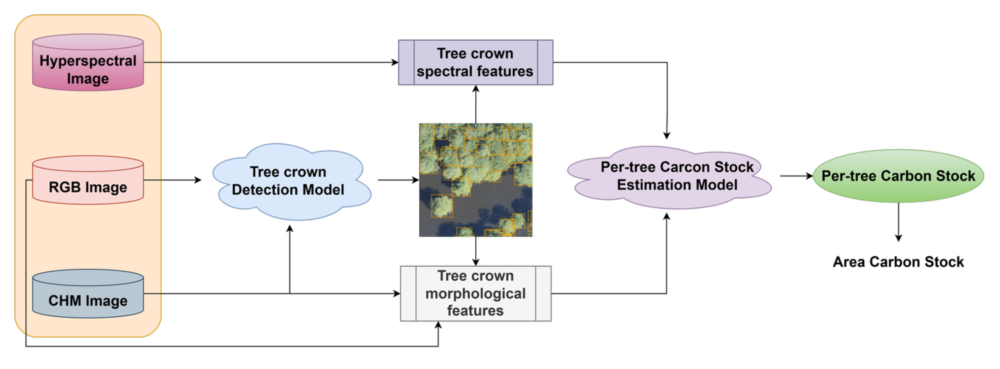
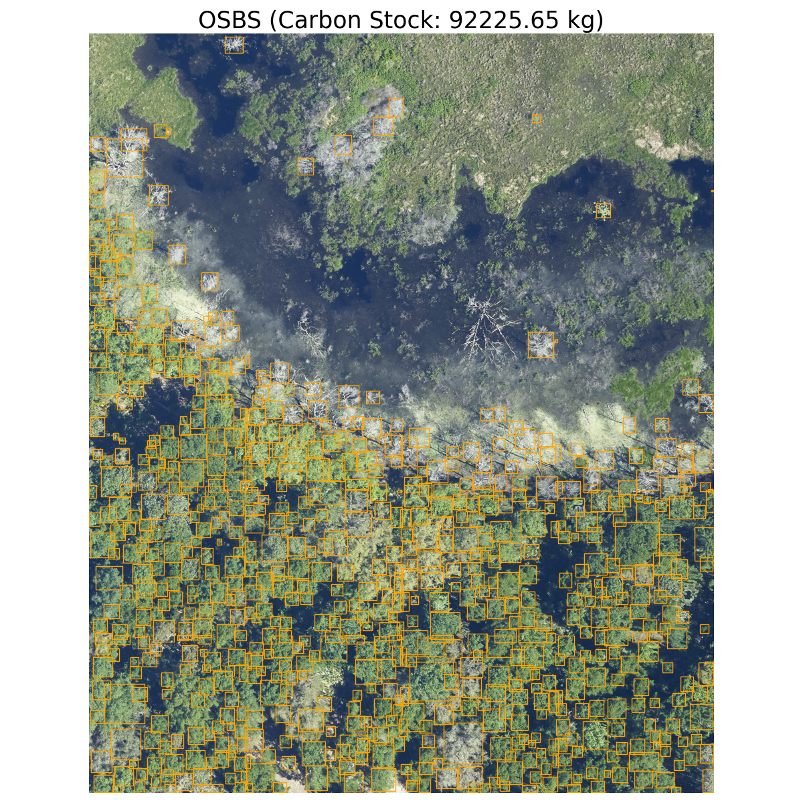

# Multimodal Tree Crown Detection and Carbon Stock Estimation from Remote Sensing Imagery

A framework for automated tree detection and carbon stock estimation from aerial imagery using multi-modal remote sensing data (RGB, Canopy Height Model, and Hyperspectral imagery).




## Overview

This codebase implements multiple state-of-the-art object detection models for tree crown delineation and combines them with machine learning approaches for carbon stock estimation. The framework supports various deep learning architectures including Faster R-CNN, DETR, YOLOv12, and the proposed Height-perceptual Attention Fusion R-CNN (HAF R-CNN) architecture.

## Project Structure

```
├── config.yml                     # Main configuration file
├── train.py                      # Training script for detection models
├── test.py                       # Evaluation script for trained models
├── main_estimate.py              # Carbon stock estimation pipeline
├── carbon_stock_regression.py    # Carbon stock modeling experiments
├── environment.yml               # Conda environment specification
│
├── datasets/                     # Dataset handling
│   ├── __init__.py
│   └── dataset.py               # TreeDataset class for NEON data
│
├── models/                       # Model architectures
│   ├── __init__.py
│   ├── engine.py                # Training and evaluation engines
│   ├── utils.py                 # Model utilities
│   ├── gpu.py                   # GPU management
│   ├── rcnn/                    # Faster R-CNN implementations
│   ├── detr/                    # DETR implementation
│   ├── yolo/                    # YOLOv12 implementation
│   ├── fused_rcnns/            # HCF R-CNN architecture
│   ├── backbones/              # Various backbone networks
│   ├── attention/              # Attention mechanisms
│   └── DeepForest/             # DeepForest wrapper
│
├── utils/                        # Utility functions
│   ├── __init__.py
│   ├── data_utils.py
│   ├── logger.py
│   ├── metrics.py
│   ├── visualize.py
│   └── misc.py
│
├── carbon_stock_estimation/      # Carbon estimation utilities
│   └── utils.py
│
├── data/                         # Data directory
│   └── preprocessed/            # Preprocessed NEON dataset
│       ├── train/
│       └── test/
│
├── experiments/                  # Experiment outputs
│   ├── checkpoints/             # Model checkpoints
│   └── logs/                    # Training logs
│
├── inferences/                   # Inference outputs
├── losses/                       # Custom loss functions
└── scripts/                      # Utility scripts
    ├── fetch_dataset.sh
    └── update_annotation_path.py
```

## Installation

1. **Clone the repository:**
   ```bash
   git clone https://github.com/SebastianKyle/remote-sensing-carbon-stock-estimation.git
   cd remote-sensing-carbon-stock-estimation
   ```

2. **Create conda environment:**
   ```bash
   conda env create -f environment.yml
   conda activate tree_delineation
   ```

## Dataset Preparation

This project uses the NEON Tree Dataset. Ensure your data follows this structure:

```
data/preprocessed/
├── train/
│   ├── RGB/          # RGB imagery (.tif)
│   ├── CHM/          # Canopy Height Models (.tif)
│   └── annotations/  # COCO format annotations (.json)
└── test/
    ├── RGB/
    ├── CHM/
    └── annotations/
```

Update the `data_dir` path in `config.yml` to point to your preprocessed data directory.

One can download original NEON dataset [here](https://zenodo.org/records/5914554), the preprocessed NEON dataset [here](https://drive.google.com/file/d/1UUIcs9qQZUowSQZajSDYbyhHVrKxKgn_/view?usp=sharing).

Original IDTReeS competition dataset can be downloaded [here](https://zenodo.org/records/3934932).

Preprocessed field-based data from IDTReeS competition (.csv file) can be downloaded [here](https://drive.google.com/file/d/1qjN0mCmqcW4Ay76OFX2ci00BVyHG8tyd/view?usp=sharing).

## Configuration

The main configuration is managed through `config.yml`. Key sections include:

### Training Configuration
```yaml
training:
  model: 'hcf_rcnn'              # Model type: faster_rcnn, hcf_rcnn, detr, yolov12
  data_dir: 'path/to/data/preprocessed/'
  batch_size: 1
  epochs: 100
  lr: 0.0001
  optimizer: 'sgd'               # sgd, adam, adamw
  lr_scheduler: 'cosine'         # step, cosine, onecycle
  frcnn_input: 'rgb'            # rgb, chm, both
```

### Test Configuration
```yaml
test:
  model: 'hcf_rcnn'
  ckpt_path: 'path/to/best/checkpoint.pth'
  data_dir: 'path/to/data/preprocessed/'
```

### Inference Configuration
```yaml
inference:
  conf_thresh: 0.15              # Confidence score for tree crown detection
  site: 'DELA'                   # NEON site identifier
  rgb_tile_path: 'path/to/large/rgb/tile.tif'
  chm_tile_path: 'path/to/large/chm/tile.tif'
  hsi_tile_path: 'path/to/large/hsi/tile.tif'
  ckpt_path: 'path/to/trained/model.pth'
  rf_model_path: 'path/to/carbon/model.pkl'
```

## Usage

### 1. Training

Train a tree detection model:

```bash
python train.py --config config.yml
```

**Optional command-line arguments:**
```bash
python train.py \
    --config config.yml \
    --model hcf_rcnn \
    --epochs 50 \
    --batch_size 2 \
    --lr 0.001 \
    --optimizer adam
```

**Available models:**
- `faster_rcnn`: Standard Faster R-CNN with ResNet50 backbone
- `hcf_rcnn`: Hierarchical Channel Fusion R-CNN (our proposed method)
- `detr`: Detection Transformer
- `yolov12`: YOLOv12 architecture

### 2. Testing

Evaluate a trained model:

```bash
python test.py --config config.yml
```

The script will load the best checkpoint and evaluate on the test set, reporting:
- Precision, Recall, F1-score
- Average Precision (AP)
- Mean Intersection over Union (IoU)

Trained model weights can be downloaded in [Experimental Results](#experimental-results).
<!-- - HAF R-CNN: [drive](https://drive.google.com/file/d/1s95FEEChH0MMNF020bdabi7aCKscyf9v/view?usp=sharing)
- HAF R-CNN (no CAWF): [drive](https://drive.google.com/file/d/1o8VL1ASgxaCALcMobo8gd41uVzcnwode/view?usp=sharing)
- Faster R-CNN (RGB): [drive](https://drive.google.com/file/d/1wUgje9t7VtjMxYleo1WNPKsZAMV45pTs/view?usp=sharing)
- Faster R-CNN (CHM): [drive](https://drive.google.com/file/d/1V6WPzI9dvWMoLmyVLnfXklbqcvmXlBmC/view?usp=sharing)
- Yolov12 (RGB): [drive](https://drive.google.com/file/d/10eG8FaLU0e-J0ATV0susS96eLXvzNY_A/view?usp=sharing) -->

### 3. Carbon Stock Estimation

#### Option A: End-to-end Pipeline
```bash
python main_estimate.py --config config.yml
```

This runs the complete pipeline:
1. Tree detection on large aerial tiles (available in original NEON training dataset in this [link](https://zenodo.org/records/5914554))
2. Feature extraction from detected trees
3. Carbon stock prediction using trained regression model
4. Visualization of results

#### Option B: Train Carbon Stock Models
```bash
python carbon_stock_regression.py
```

This script trains and evaluates three regression models:
- Random Forest Regression
- Deep Learning (Neural Network)
- Linear Regression with stepwise selection

Pretrained random forest model can be downloaded from [drive](https://drive.google.com/file/d/1Y3aA_SU2SGPLahD4gJqH4IP8DrxsXjsW/view?usp=sharing).
Neon aop bands file can be downloaded from [drive](https://drive.google.com/file/d/1wF-tB-m8oNYP1bPDlGEQavOzsAnSc60_/view?usp=sharing).

### 4. Visualization

The framework includes comprehensive visualization tools:

```python
from utils.visualize import visualize_image_with_annotation
from datasets.dataset import TreeDataset

# Visualize dataset samples
dataset = TreeDataset(data_dir, train=False)
visualize_image_with_annotation(dataset, 'sample_id', mode='rgb')
```

## Model Architectures

### 1. HAF R-CNN (Height-perceptual Attention Fusion R-CNN)
Our proposed architecture that fuses RGB and CHM features through cross-attention mechanisms.

### 2. Faster R-CNN
Standard two-stage object detection with feature pyramid networks.

### 3. DETR (Detection Transformer)
Transformer-based object detection with set prediction.

### 4. YOLOv12
Single-stage detection with improved architecture and loss functions.

## Carbon Stock Estimation

The carbon stock estimation pipeline includes:

1. **Feature Extraction**: From RGB, CHM, and hyperspectral data
2. **Regression Models**: 
   - Random Forest (primary model)
   - Deep Neural Network
   - Linear Regression
3. **Evaluation Metrics**: RMSE, MAE, R², and PMAE

### Feature Categories:
- **Structural**: Crown area, crown diameter, tree height, ...
- **Spectral**: Vegetation indices from hyperspectral bands

## Experimental Results

### Tree Crown Detection (NEON Test Set)

| Model                  | Input    | Recall | Precision | AP     | F1     | Checkpoint |
|-------------------------|----------|--------|-----------|--------|--------|------------|
| Faster R-CNN      | RGB      | 0.5848 | 0.5961    | 0.6158 | 0.5904 | [download](https://drive.google.com/file/d/1wUgje9t7VtjMxYleo1WNPKsZAMV45pTs/view?usp=sharing) |
| Faster R-CNN      | CHM      | 0.2794 | 0.3217    | 0.2927 | 0.2990 | [download](https://drive.google.com/file/d/1V6WPzI9dvWMoLmyVLnfXklbqcvmXlBmC/view?usp=sharing) |
| YOLOv12           | RGB      | 0.5474 | 0.5601    | 0.5557 | 0.5537 | [download](https://drive.google.com/file/d/10eG8FaLU0e-J0ATV0susS96eLXvzNY_A/view?usp=sharing) |
| DeepForest        | RGB      | 0.6233 | 0.5214    | 0.6235 | 0.5658 | [official weights](https://huggingface.co/weecology/deepforest-tree) |
| **HAF R-CNN (ours)**       | RGB+CHM  | 0.6157 | 0.6230    | 0.6444 | 0.6193 | [download](https://drive.google.com/file/d/1s95FEEChH0MMNF020bdabi7aCKscyf9v/view?usp=sharing) |
| **HAF R-CNN (no CAWF)**    | RGB+CHM  | 0.6079 | 0.6026    | 0.6361 | 0.6052 | [download](https://drive.google.com/file/d/1o8VL1ASgxaCALcMobo8gd41uVzcnwode/view?usp=sharing) |

### Carbon Stock Estimation - Random Forest (IDTReeS Dataset)

| Site   | RMSE (kg) | MAE (kg) | PMAE (%) | R²     | Checkpoint |
|--------|-----------|----------|-----------|--------|-------------|
| OSBS   | 117.83    | 59.58    | 45.63     | 0.6702 | [RF Model](https://drive.google.com/file/d/1Y3aA_SU2SGPLahD4gJqH4IP8DrxsXjsW/view?usp=sharing) |
| MLBS   | 204.98    | 144.45   | 61.06     | 0.3524 | Same as above |
<!-- | Overall (204 trees) | 184.52    | 118.94   | 58.51     | 0.4340 | [RF Model](https://drive.google.com/file/d/1Y3aA_SU2SGPLahD4gJqH4IP8DrxsXjsW/view?usp=sharing) | -->

### Large-scale Carbon Stock Estimation
Confidence threshold: 0.15
<p align="center">
  
  
</p>

<!-- ## Citation

If you use this code in your research, please cite our paper:

```bibtex
@article{my_paper_2024,
  title={My Paper Title},
  author={My Name and Collaborators},
  journal={Conference/Journal Name},
  year={2025}
}
``` -->

## License

This project is licensed under the MIT License - see the LICENSE file for details.

## Acknowledgments
- Faculty of Information Technology - VNUHCM University of Science for providing computing resources to conduct such experiments.
- NEON (National Ecological Observatory Network) for making the remote-sensing dataset and DeepForest model checkpoint public.
